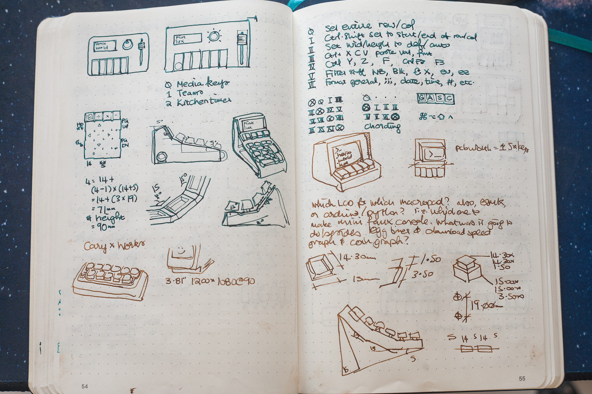
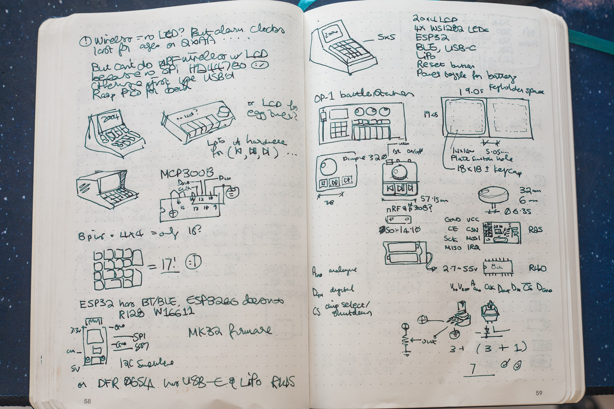
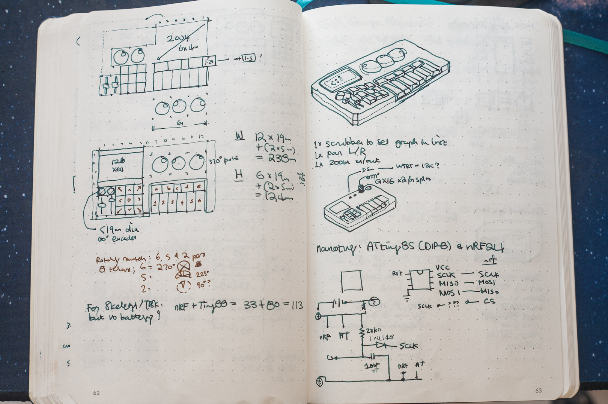

# piano-macropad
Work in progress handwired macropad. 

Not yet complete, and not yet suitable for 3D printing. 

## Background
I wanted to create a small macropad for media controls (previous, pause, next, volume). I also wanted to make a numpad with some Excel specific macros. 

Somewhere along the lines, they got merged into one macropad, and the media portion not only changed from 1u keys to 2u keys, they also grew a second rowm, which tried to resemble the flat/sharp keys on a piano.

An LCD got added in, because I have a few lying around which I need an excuse to use, and because keeping track of unfrequently used keymaps was getting a big tricky.

Lastly, two more scrubbers/rotary encoders got added in because there was enough space.

## More background
I ran into space issues trying to fit the MCU and the battery behind the screen, so I enlarged the bottom shell by giving it a small slope. I still haven't finalised the MCU or wiring or the ports on the backpanel yet.

## Screenshots

## Pen and Paper Sketches

